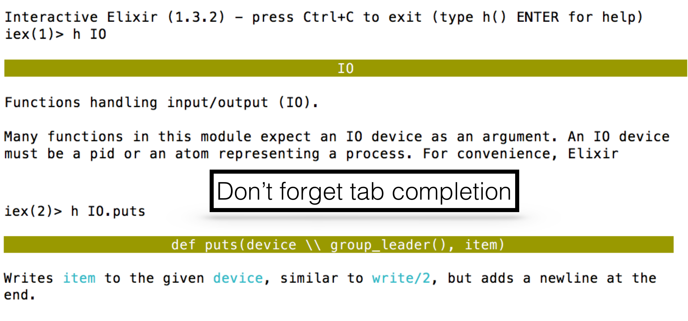
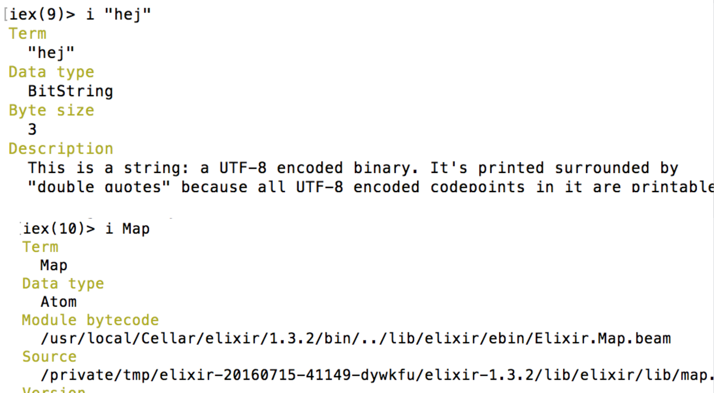

# The Elixir Language

[Back](index.html)


# Content

* Installation and Irb
* Language:
  * Operators, Datatypes
  * Functions/Modules, Pattern Matching
  * Comprehension, Control Flow
  * Typespecs, Behaviours
  * Protocols, Macros


# Installation

* `brew install elixir`
* https://elixir-lang.org/install.html

## IEX

[](img/iex.png)


## inspect

[]


## Hello World

```elixir
IO.puts "Hello"
```


## Compiling

```
iex> c "hello.exs"
iex> import_file "hello.exs"
iex> r HelloWorld
```


## A Convention

* `.ex` files compiles to Erlang
* `.exs` intepreted


## VSCODE

* vscode-elixir
* ElixirLS
* vscode-elixir-formatter


# The Language


## The Fundamental

* Modules
* Functions
* Data Structures


## Kernel Module

```
Kernel.+(1,2)
# same as 1 + 2
```


## True and False

Everything is truthy except for `false` and `nil`

```
iex> !nil || !!"hej"
true
```


## Equal

* value equality: `==`
  * `1 == 1.0` is true (use === for strict)
  * `5 == "5"` is false
  * `"" == false` is false

(The only difference between == and === is that === is strict when it comes to comparing integers and floats)


## And/Or

* `or`, `and`

  `(1 and 0)` => (ArgumentError) argument error: 1

* `||`,  `&&`, `!`

  `(1 && 0)` => 0


## Operators: ++/--

```elixir
# ++ and -- are List functions
[1,2,3] ++ [4,5]
[1,2,3,4] -- [2,5] # => [1, 3, 4]
```


## String <> operator

To concatenate two Strings
```elixir
"hej" ++ "hopp"
```


## In operator

```elixir
2 in [1,2,3] # => true
x in some_enum
```


## The Pipe Operator

Instead of

```elixir
a = "abc"
b = do_x(a)
c = do_y(b, "foo")
d = do_z(c)
```

Use the pipe operator

```elixir
"abc" |> do_x |> do_y("foo") |> do_z
```


##  Phoenix

```elixir
connection
|> endpoint
|> router
|> pipeline
|> controller
```


## Range

```elixir
1..4
```


# Data Types


## Atoms

Examples:
```elixir
:hej
:"hej"
:<>
FooBar
Hello.Foo
```


## Regular Expressions ~r{}

```elixir
~r[foo]
~r/foo/
~r<foo>
~r(foo)
String.match?("hej hopp", ~r/ho/)
```
~r is a sigil that creates a data type struct


## Tuples

Ordered collection of values

```elixir
{1,2}
{:ok, "Hej", false}
# nested
{:ok, {1, "foo", {true, false}}, [1,2,3]}
```


## List

```elixir
a = [1, 2, "hej", false]
List.first(a)  # not often used !

# Lists can be charlist !
IO.puts "hej #{[49, 50, 51]}"  # =>  hej 123
```


## PIDs

```
iex> i self()
Term
  #PID<0.80.0>
Data type
  PID
Alive
  true
Name
  not registered
Links
  none
Message queue length
  0
Description
  Use Process.info/1 to get more info about this process
Reference modules
  Process, Node
```


## string

* Double quoted
* Holds UTF-8 characters
* Escapes sequences, `\n`, `\a`, ...
* Allows interpolation, `#{}` syntax

```elixir
name = "andreas"
IO.puts "Hello #{String.capitalize name}"
```


## string

```text
Term
  "123"
Data type
  BitString
Byte size
  3
Description
  This is a string: a UTF-8 encoded binary. It's printed surrounded by
  "double quotes" because all UTF-8 encoded codepoints in it are printable.
Raw representation
  <<49, 50, 51>>
Reference modules
  String, :binary
Implemented protocols
  Collectable, IEx.Info, Inspect, List.Chars, String.Chars
```


## Heredoc notation

Strings can span several lines.

```elixir
IO.write """
line 1
line 2
"""
```


## Charlist

```text
iex> i '123'
Term
  '123'
Data type
  List
Description
  This is a list of integers that is printed as a sequence of
  characters delimited by single quotes because all the integers
  in it represent valid ASCII characters. Conventionally, such
  lists of integers are referred to as "charlists" (more
  precisely, a charlist is a list of Unicode codepoints, and ASCII
  is a subset of Unicode).
Raw representation
  [49, 50, 51]
Reference modules
  List
```


## char list

A list of non-negative integers

```elixir
a = 'abc'
# example of list functions available
length a # => 3
Enum.reverse(a) # => 'cba'
'abcd' ++ 'de'
'abcd' -- 'de'
?a # => 97  The ascii code
 ```


## Sigils

Some more sigils:
```
# A double quoted string
~s[hej "]

# List of whitespace delimited words, no escaping or interpolation
~W<hej hopp x#{}>  

# Dates
~D[2001-01-01]
```


## Exercise

Write something so that
```
* "a,b,c" |> ... # => "c,b,a"
* concatenate two strings
```

(use the `Enum` and `String` modules)


## Answer

```elixir
"a,b,c" |> String.split(",") |> Enum.reverse |> Enum.join
```


## Binaries

```
iex> bit_size(<<0, 1, 2>>)
24

iex> << 1::size(2), 1::size(3) >>
<<9::size(5)>>

iex> bit_size(<<2.5::float>>)
64

iex> <<72, 69, 74>>
"HEJ"  (!!!)
```


## Keyword Lists

```text
iex> [{:a, 1}, {:b, 2}]  # Array with tuples
[a: 1, b: 2]  # What ?

iex> [a: 1, b: 2]
[a: 1, b: 2]
```


## Keyword Lists

* Can be used with `Enum` and `Keyword`
* Keys are ordered
* Keys can be given more than once
* Square bracket optional in last arg


## Last argument

can be a keyword list

```elixir
defmodule Foo do                                   
  def foo(x,y), do: IO.puts("x: #{x} y: #{inspect y}")
end
```

```
iex(72)> Foo.foo "hej", a: 2                                 
x: hej y: [a: 2]
```


## Exercise

```
kw = [a: 1, b: 2, c: 3]
```

1. Check if key `:b` is in `kw`
2. Update `c` to 42

(use the Keyword module)


## Answer

```elixir
# 1)
kw = [a: 1, b: 2, c: 3]
Keyword.has_key?(kw, :b)
kw[:b] # access

# 2) Creates a new keyword list
Keyword.put(kw, :b, 42)  
```


## Maps

* Allows any value as a key
* Keys do not follow any ordering
* Useful for pattern matching


## Maps

```
iex> x = %{:foo => 1, 2 => :bar, "hej" => "hopp"}
%{2 => :bar, :foo => 1, "hej" => "hopp"}

iex> x[:foo]
1

iex> x[2]
:bar

iex> x.foo
1

iex> x.qwe
** (KeyError) key :qwe not found in: %{2 => :bar, ...
```


## Map convenience

When all the keys in a map are atoms, you can use the keyword syntax

```
iex> map = %{a: 1, b: 2}
%{a: 1, b: 2}
```


## Exercise

```
x = %{a: 1, foo: 42, bar: "hello"}
```

1. create a list of the keys
2. change `bar` prop to "bye"
3. add a new key and value

(Use the `Map` api)


## More convenience

```
iex(15)> map = %{:a => 1, 2 => :b}
%{2 => :b, :a => 1}
iex(16)> map.a    # Strict access (prefer)
1

iex(17)> map.c    # Strict access
** (KeyError) key :c not found in: %{2 => :b, :a => 1}

iex(18)> map[:c]  # Dynamic access
nil

iex(17)> %{map | :a => 2}
%{2 => :b, :a => 2}

iex(18)> %{map | :c => 3}
** (KeyError) key :c not found in: %{2 => :b, :a => 1}
```


## Nested Data

```
iex> users = [
...>   john: %{name: "John", age: 27, languages: ["Erlang", "Ruby", "Elixir"]},
...>   mary: %{name: "Mary", age: 29, languages: ["Elixir", "F#", "Clojure"]}
...> ]
[john: %{age: 27, languages: ["Erlang", "Ruby", "Elixir"], name: "John"},
 mary: %{age: 29, languages: ["Elixir", "F#", "Clojure"], name: "Mary"}]

iex> users[:john].age
27
```


## Updates

put_in

```
iex)> users = put_in users[:john].age, 31

[john: %{age: 31, languages: ["Erlang", "Ruby", "Elixir"], name: "John"},
 mary: %{age: 29, languages: ["Elixir", "F#", "Clojure"], name: "Mary"}]
```


## Exercise

1. Create a list
2. Create a tuple with 2 atoms and 2 charlists
3. Create a Keyword list
4. Create a map with Atom keys
5. Create a map with String keys


## Structs

* A map where all keys must be atom
* Only declared keys are allowed
* Compile time checks


## Example Usage

```elixir
defmodule Person do
  defstruct name: "", age: 0
end
```

```
iex> %Person{}
%Person{age: 0, name: ""}
iex> %Person{name: "Andreas"}
%Person{age: 0, name: "Andreas"}
iex> p = %Person{name: "Andreas"}
%Person{age: 0, name: "Andreas"}
iex> p.age
0
iex> p.qwe
** (KeyError) key :qwe not found in: %Person{age: 0, name: "Andreas"}
```


## Updating Structs

```
# Avoid
iex> me = Map.put(%Person{}, :name, "Andreas")

# Better
iex> me = struct(Person, name: "Andreas")

# Or
iex(36)> %Person{me | name: "you"}
%Person{age: 0, name: "you"}
```


## Required Keys

```
defmodule Car do
  @enforce_keys [:make]
  defstruct [:model, :make]
end

iex> %Car{}
** (ArgumentError) the following keys must also be given when building struct Car: [:make]
```


## Compile time checks

```elixir
defmodule User do
  defstruct name: "", age: 0
end

defmodule UserRepo do
  def create_user(name), do: %User{nam2e: name}
end
```

```
== Compilation error on file struct.ex ==
** (KeyError) key :nam2e not found in: %User{age: 0, name: ""}
    (stdlib) :maps.update(:nam2e, {:name, [line: 6], nil}, %User{age: 0, name: ""})
    struct.ex:2: anonymous fn/2 in User.__struct__/1
    (elixir) lib/enum.ex:1623: Enum."-reduce/3-lists^foldl/2-0-"/3
    expanding struct: User.__struct__/1
    struct.ex:6: UserRepo.create_user/1
```


## Exercise

```
%Plug.Conn{host: "www.example.com",
           path_info: ["bar", "baz"]}

```

* Create the struct
* Create an instance with the data above
* Update host to "foo.com"
* Add "foobar" to `path_info`


## Answer

```elixir
defmodule Plug.Conn do
  defstruct host: "", path_info: []
end

conn = %Plug.Conn{host: "www.example.com", path_info: ["bar", "baz"]}
%{conn | host: "foo.com"}
put_in conn.path_info, conn.path_info ++ ["foobar"]
```


# Functions/Modules


## Anonymous functions

```
iex> sum = fn (a, b) -> a + b end
#Function<12.52032458/2 in :erl_eval.expr/5>

iex> sum.(1,2) # Notice the dot !
3
```


## Closures

```
x = 1
sum = fn y -> x + y end
sum.(2) #=> 3
```


## Modules

```elixir
defmodule MyModule do
  def sum(x, y) do
    x + y
  end

  # oneliner, notice similarity to keyword list
  def add_one(x), do: sum(x, 1)  # No dot needed
end
```

```
iex> MyModule.add_one(42)
```


## Exercise

Create the `silly` function so that

```elixir
f = fn (x) -> x * 2 end

42 |> MyModule.silly(f) # "x: 84"
```


## Answer

```elixir
defmodule MyModule do                      
  def silly(val, fun), do: "x: #{fun.(val)}"
end
```


## import

* Allows using without fully-qualified name.

```
iex> import MyModule
iex> add_one(2)
```

(`require` is for macros)


## import scope

```elixir
defmodule Example do
  def func1 do
    List.flatten [1,[2,3],4]
  end

  def func2 do
    import List, only: [flatten: 1]
    flatten [5,[6,7],8]
  end
end
```


## Calling Erlang

Syntax: `<atom>.<function>([args])`

```elixir
:erlang.element(1, {1,2,3,4})
:random.uniform()
```

Btw, autocomplete in IRB works


## Conventions

* `?` postfix returns false/true

  Example: `String.contains?/2`
* `!` postfix may throw exception

  Example: `File.open!/1`

* snake_case atoms, functions, variables and files.


## Nested Modules
and file location

```
lib
|-- ecto
|   |-- adapter
|   |   |-- migration.ex
```

```elixir
defmodule Ecto.Adapter.Migration  do
  # ...
end
```


## Function Refs

```
iex> a_func = &MyModule.add_one/1
&MyModule.add_one/1
iex> a_func.(2)

iex> l = &length/1
&:erlang.length/1
 ```


## Function shortcuts

```
iex(32)> sum = &(&1 + &2)
&:erlang.+/2   # <----- !!!!

iex(33)> sum.(1,2)
3
```


## Curry ?

```
iex> multi = fn(x,y) -> x * y end  # or &(&1 * &2)
#Function<12.128620087/2 in :erl_eval.expr/5>
iex> times2 = &(multi.(2, &1))
#Function<6.128620087/1 in :erl_eval.expr/5>
iex> times2.(42)
```


## Function returning function

```
iex> add_n = fn n -> (fn other -> n + other end) end
#Function<6.52032458/1 in :erl_eval.expr/5>

iex> add_two = add_n.(2)
#Function<6.52032458/1 in :erl_eval.expr/5>

iex> add_two.(3)
5

```


## Exercises

* A) Use `Enum.map` to make

   `[1,2,3] |> ___ => [2,3,4]`

* B) Write a function that takes a function so that

  `a_function.(fn -> "hej" end)`
  returns: "hej hopp"


## Solutions

```elixir
# A)
[1,2,3] |> Enum.map(&(&1 + 1))

# B)
a_function = fn(f) -> "#{f.()} hopp" end
```


## Module attributes

```elixir
defmodule Example do
  @author "Andreas"
  def get_author do
    @author
  end
end

IO.puts "Example was written by #{Example.get_author}"
```


# Pattern Matching


## Simple values

```
iex> 1 = 1
1
iex> 1 = 0
** (MatchError) no match of right hand side value: 0
iex> x = 3
iex> 3 = x
3
iex> 4 = x
** (MatchError) no match of right hand side value: 3
iex> x = 4
4
iex> ^x = 4
4
iex> ^x = 5
** (MatchError) no match of right hand side value: 5
```


## Tuples

```
iex(1)> {a, b} = {1,2}
{1, 2}
iex(2)> {a, b} = {b, a}
{2, 1}
iex(3)> {x, _} = {{1,true}, "foo"}
{{1, true}, "foo"}
iex(4)> {{1, flag}, "foo"} = {{1,true}, "foo"}
{{1, true}, "foo"}
iex(5)> flag
true
iex(6)> {q={1, flag}, "foo"} = {{1,true}, "foo"}
{{1, true}, "foo"}
iex(7)> q
{1, true}
```


## Tuples Practical Examples

```
iex> {status, file} = File.open("mix.exs")
{:ok, #PID<0.83.0>}

iex> {:ok, file} = File.open("mix.exs")   
{:ok, #PID<0.85.0>}
```


## Arrays

```
list = [1, 2, 3]
[a, b, c ] = list   # Ok, a = 1, b = 2, c = 3
[a, 2, b ] = list   # OK
[a, 3, b ] = list   # Match Error
[a, b, c] = [1, [2, 3], 4]
[a, [b, _], c] = [1, [2, 3], 4]  # _ = I don’t care
```


## Exercises

Which will match when `x = 4` ?
1. `[a, b, a] = [1, 2, 3]`
2. `[a, b, a] = [1, 2, 1]`
3. `[_, b, a] = [1, 2, 3]`
4. `[a, b] = [1, 2, 3]`
5. `[a, b, c] = [1, 2]`
6. `[x, b, c] = [1, 2, 3]`
7. `[^x, b, c] = [1, 2, 3]`


## Append to array

```
[9 | [1,2,3]] # =>  [9,1,2,3]
```


## Head and Tails

```
iex> a = [1,2,3,4]
[1, 2, 3, 4]
iex> [h | t] = a
[1, 2, 3, 4]
iex> h
1
iex> t
[2, 3, 4]
iex> hd(a)  # head
1
iex> tl(a)  # tail
[2, 3, 4]
```


## More heads

```
iex> [h1, h2 | t] = a
[1, 2, 3, 4]
iex> h1
1
iex> h2
2
iex> t
[3, 4]
```


## Pattern Matching Heads

```
iex> [t1, 2 | t] = a
[1, 2, 3, 4]

iex> [t1, 3 | t] = a
** (MatchError) no match of right hand side value: [1, 2, 3, 4]
```


## Heads with nested data

```
iex> icecreams = [{"cookies", 5}, {"chocolate", 3}, {"mint", 4}]
iex> [{name, _} | _] = icecreams
[{"cookies", 5}, {"chocolate", 3}, {"mint", 4}]
iex> name
"cookies"

# What does this do ?
iex>[f={_, c}|t] = icecreams
```


# with

Combines matching clauses.

```
iex> opts = %{width: 10, height: 15}
iex> with {:ok, width} <- Map.fetch(opts, :width),
...>      {:ok, height} <- Map.fetch(opts, :height),
...>   do: {:ok, width * height}
{:ok, 150}
```

[Kernel.SpecialForms.html#with/1](https://hexdocs.pm/elixir/Kernel.SpecialForms.html#with/1)


## Function argument

```elixir
defmodule Bar do
	def hi("hi"), do: "ho"
	def hi(1), do: "one"
	def hi(x), do: "got #{x}"
end
```


## Default parameters

```elixir
@defaults %{color: "black", shape: "circle"}
def draw(options \\ [] ) do
  %{color: color, shape: shape} = Enum.into(options, @defaults)
  IO.puts("Draw a #{color} #{shape}")
end
```


## List and Recursion

```elixir
defmodule MyList do
  def len([]), do: 0
  def len([_head | tail]), do: 1 + len(tail)
end
```

* Is `len` tail-recursive ?
* If not how to impl. it ?


## More Recursion

```elixir
defmodule Fib do
  def fib(0) do 0 end
  def fib(1) do 1 end
  def fib(n) do fib(n-1) + fib(n-2) end
end
```


## Advanced pattern matching

What does this do ?
[PragProg Example](https://media.pragprog.com/titles/elixir/lists.pdf)

```elixir
# Example of data: [ timestamp, location_id, temperature, rainfall ]
defmodule WeatherHistory do

  def for_location([], target_loc), do: []
  def for_location([ head = [_, target_loc, _, _ ] | tail], target_loc) do
   [ head | for_location(tail, target_loc) ]
  end
  def for_location([ _ | tail], target_loc), do: for_location(tail, target_loc)
end
```


## String pattern matching

```elixir
def greet("Ben" <> _) do
 IO.puts("Hello, Ben")
end
```


## Keyword List

Rarely done since pattern matching on lists requires the number of items and their order to match

```
iex> [a: a] = [a: 1]
[a: 1]
```


## Maps

```
iex> %{:a => a} = %{:a => 1, 2 => :b}
%{2 => :b, :a => 1}

iex> a
1

iex> %{:c => c} = %{:a => 1, 2 => :b}
** (MatchError) no match of right hand side value: %{2 => :b, :a => 1}
```


## Exercises, Destructing

Example:
Set `a = :bar` from `{:foo, :bar}`

Solution: `{_, a} = {:foo, :bar}`

* a) Set `a=:b` from  `[{:a,:b,:c}]`
* b) Set `a=4` from  `[[1,2], [3,4]]`
* c) Set `a=4` and `b=[3,4]` from `[[1,2], [3,4]]`
* d) Set `a="kalle"` from `[{3, %{name: "kalle"}}]`


## Answers

```elixir
# a)
[{_,a,_}] = [{:a,:b,:c}]

# b)
[_, [_, a]] = [[1,2], [3,4]]

# c)
[_, b=[_,a]] = [[1,2], [3,4]]

# d)
[{_, %{name: a}}] = [{3, %{name: "kalle"}}]  
```


## Matching function args

```
iex> f = fn({_, price}) -> price end
iex> f.({"vanilla", 3})             
3
# or elem({"vanilla", 3}, 1)
```


## Exercies

Impl first_name so that:
```elixir
iex> icecreams = [{"cookies", 5}, {"chocolate", 3}, {"mint", 4}]
[{"cookies", 5}, {"chocolate", 3}, {"mint", 4}]
iex> first_name.(icecreams)
"cookies"
```


## Answers

```elixir
first_name = fn([{name, _}|_]) -> name end
```


## Function with multiple bodies

```
iex> handle_open = fn
...> {:ok, file} -> "Read #{IO.read(file, :line)}"
...> {_, error} -> "Error: #{:file.format_error(error)}"
...> end
#Function<6.52032458/1 in :erl_eval.expr/5>

iex(6)> handle_open.(File.open("notexist.txt"))
"Error: no such file or directory"
```


## Exercises 1

Create a function: that returns the total price of all ice creams.
Use `Enum` functions

```
icecreams = [{"cookies", 5}, {"chocolate", 3}, {"mint", 4}]
# e.g. icecream |> ...
```


## Solutions 1

```elixir
icecreams |> Enum.map(fn({_, price}) -> price end) |> Enum.sum
# or
icecreams |> Enum.map(&elem(&1, 1)) |> Enum.sum
```


## Exercises 2, recursive

Do not use `Enum`, use recursion

* Return the length of the array
* Get the total price of all ice creams
* Create a module: Price

```
icecreams = [{"cookies", 5}, {"chocolate", 3}, {"mint", 4}]
```

(Erlang has tail call optimization)


## Solution

```elixir
defmodule Price do
  def calc(list), do: calc(list, 0)
  def calc([], sum), do: sum
  def calc([{_, price} | t], sum), do: calc(t, sum + price)
end
```


## Guards

```elixir
defmodule Guard do
  def what_is(x) when is_number(x) do
    IO.puts "#{x} is a number"
  end

  def what_is(x) when is_list(x) do
    IO.puts "#{inspect(x)} is a list"
  end

  def what_is(x) when is_atom(x) do
    IO.puts "#{x} is an atom"
  end
end
Guard.what_is(99) # => 99 is a number
Guard.what_is(:cat) # => cat is an atom
Guard.what_is([1,2,3]) # => [1,2,3] is a list
```


## Strings/Binaries

```elixir
"hej" <> hopp  = "hejhopp"
[h| t] = to_charlist("abcd")

 <<0, 1, x>> = <<0, 1, 2>> # match 3 bytes
 <<0, 1, x :: binary>> = <<0, 1, 2, 3>>  #
```


# Comprehension


## Examples

```
iex> for n <- [1, 2, 3, 4], do: n * n
[1, 4, 9, 16]

iex> values = [good: 1, good: 2, bad: 3, good: 4]
[good: 1, good: 2, bad: 3, good: 4]

iex> for {:good, n} <- values, do: n * n
[1, 4, 16]

iex> multiple_of_3? = fn(n) -> rem(n, 3) == 0 end
#Function<6.52032458/1 in :erl_eval.expr/5>

iex> for n <- 0..5, multiple_of_3?.(n), do: n * n
[0, 9]
```


## into

```elixir
for {key, val} <- %{"a" => 1, "b" => 2}, into: %{}, do: {key, val * val}
%{"a" => 1, "b" => 4}
```


# Control Flow


## case, example 1

```elixir
case {1, 2, 3} do
 {1, x, 3} when x > 0 -> "Will match"
 _ ->  "Would match, if guard condition were not satisfied"
end
```


## case, example 2

```elixir
case :gen_tcp.connect 'localhost', 8001, [] do
  {:ok, pid } -> pid
  {:error, reason} -> handle_error(reason)
end
```


## case, assignment

```elixir
 atom =
      case integer do
        1 -> :one
        2 -> :two
      end
```
[elixir-with-syntax-and-guard-clauses/](https://blog.sundaycoding.com/blog/2017/12/27/elixir-with-syntax-and-guard-clauses/)


## cond

Find first  conditions that evaluates to true.

```
iex> cond do
...>   2 + 2 == 5 ->
...>     "This will not be true"
...>   2 * 2 == 3 ->
...>     "Nor this"
...>   1 + 1 == 2 ->
...>     "But this will"
...> end
"But this will"
```


## if and unless
a macro : [Kernel.if](http://elixir-lang.org/docs/stable/elixir/Kernel.html#if/2)

```
iex> if nil do
...>   "This won't be seen"
...> else
...>   "This will"
...> end
"This will"
```


## if and unless, short

```
if(foo, do: bar, else: baz)
if true, do: 2, else: 4
```


## With

```elixir
with {:ok, width}  <- Map.fetch(opts, :width),
     {:ok, height} <- Map.fetch(opts, :height)
do
  {:ok, width * height}
else
  :error -> {:error, :wrong_data}
end
```


# Stream module

Similar to Enum but supports lazy operations.


## Random example

```
# see https://hexdocs.pm/elixir/Stream.html
File.stream!("/path/to/file")
|> Stream.map(&String.replace(&1, "#", "%"))
|> Stream.into(File.stream!("/path/to/other/file"))
|> Stream.run()
```


# Typespecs

* Used as documentation and for the Dialyzer tool
* Static analysis of code
* Extends the Erlang syntax


## Attributes

* `@type`
* `@opaque`
* `@typep`
* `@spec`
* `@callback`
* `@macrocallback`


## Basic Type

Examples, type ::
* `any`
* `none`
* `pid`
* `atom`
* `integer`
* `pos_integer`


## Literals

Examples, type ::
* 1
* 1..10
* [type] # list of type
* [] empty list
* (type1, type2 -> type)  # function
* {:ok, type}  


## Module Types

Example:
* Range.t
* Enum.t
* String.t


## Defining type

* Syntax:

  `@type type_name :: type`

* Example

  `@type mytype :: 1..30 | atom`

  `@type dict(key, value) :: [{key, value}]`


## Specs

* Syntax:

  `@spec function_name(type1, type2) :: return_type`


## Example

```elixir
defmodule LousyCalculator do
  @typedoc """
  Just a number followed by a string.
  """
  @type number_with_remark :: {number, String.t}

  @spec add(number, number) :: number_with_remark
  def add(x, y), do: {x + y, "You need a calculator to do that?"}

  @spec multiply(number, number) :: number_with_remark
  def multiply(x, y), do: {x * y, "It is like addition on steroids."}
end
```


## Dialyzer

* Static analysis tool
* analyze the BEAM files
* can be useful even without @specs
* Persistent Lookup Table


## Running Dialyzer

```elixir
def run, do: some_op(5, :you)
def some_op(a,b), do: a + b
```


## Output

```
dialyzer_demo (master) $ mix dialyzer
lib/dialyzer_demo.ex:19:no_return
Function run/0 has no local return.
________________________________________________________________________________
lib/dialyzer_demo.ex:19:call
The call:
DialyzerDemo.some_op(5, :you)

will never return since it differs in arguments with
positions 2nd from the success typing arguments:

(number(), number())
________________________________________________________________________________
```


## Example, overspecs flag

the specification is strictly less allowing than the success typing
```
  @spec run() :: pos_integer()
  def run, do: some_op(5, 2)

  @spec some_op(pos_integer(), pos_integer()) :: pos_integer()
  def some_op(a, b) when 
    is_integer(a) and b > 0 and 
    is_integer(b) and a > 0, do: a + b
```


## Conventions

```elixir
defmodule User do
  defstruct [:name, :email]
  @type t :: %__MODULE__{name: String.t, email: String.t}
end

defmodule OtherModule do
  @spec find_user(String.t) :: User.t
  def find_user(user), do: User%{name: "kalle"}
end
```


# Documentation

```elixir
defmodule MyApp.Hello do
  @moduledoc """
  This is the Hello module.
  """

  @doc """
  Says hello to the given `name`.

  Returns `:ok`.

  ## Examples

      iex> MyApp.Hello.world(:john)
      :ok

  """
  def world(name) do
    IO.puts "hello #{name}"
  end
end
```


# Behaviours

* Enables:
  * define a set of functions that have to be implemented
  * ensure that a module implements all the functions
* Compile time checks of function specifications
* Defined with @callback
* Abstract generic functionalities


## Behaviour and OTP

Behaviours are formalizations of these common patterns.
Divide the code for a process in a
* generic part (a behaviour module)
* specific part (a callback module).

note: British spelling


## Dynamic Invocation

```
iex> x = IO
IO
iex> x.puts "HEJ"
HEJ
:ok
iex> apply(IO, :puts, ["hej"])
hej
:ok
```

MFA - module, function, arguments list


## Silly Example

```elixir
defmodule Greeter do
  @callback say_hello(String.t) :: any
  @callback say_goodbye(String.t) :: any
end
defmodule NormalGreeter do
  @behaviour Greeter
  def say_hello(name), do: IO.puts "Hello, #{name}"
  def say_goodbye(name), do: IO.puts "Goodbye, #{name}"
end
defmodule HelloAll do
  def hello_to_all(greeters) do
    greeters |> Enum.each(& &1.say_hello("andreas"))
  end
end

HelloAll.hello_to_all([NormalGreeter])
```


## Excercie

Implement `Parser` so that:
```elixir
JSONParser.parse("foo") -> {:ok, "foo"}
Parser.parse!(JSONParser, "foo") -> "foo"
Parser.parse!(JSONParser, "bar") # raise Argument exception (iex> h raise)

defmodule JSONParser do
  @behaviour Parser
  def parse("foo"), do: {:ok, "foo"}
  def parse(_), do: {:error, "oh no"}
end
# https://elixir-lang.org/getting-started/typespecs-and-behaviours.html
```


## Solution

```elixir
defmodule Parser do
  @callback parse(String.t) :: {:ok, String.t} | {:error, String.t}

  def parse!(implementation, contents) do
    case implementation.parse(contents) do
      {:ok, data} -> data
      {:error, error} -> raise ArgumentError, "parsing error: #{error}"
    end
  end
end
```


# Protocols
Polymorphism in Elixir
Extending external modules


## Example

Enum protocol - iterate over different args.

```elixir
Enum.map [1, 2, 3], fn x -> x * x end # [1, 4, 9]
Enum.map 1..3, fn x -> x * x end # [1, 4, 9]
```


## defprotocol

To define a new
```elixir
defprotocol Blank do
 @doc "Returns `true` if `data` is considered blank/empty"
 def blank?(data)
end
```


## defimpl

For each type we need to define implementations

```elixir
defimpl Blank, for: Integer do
 def blank?(number), do: false
end

# The only blank list is the empty one
defimpl Blank, for: List do
 def blank?([]), do: true
 def blank?(_),  do: false
end

# Question, what happens:
Blank.blank?("hej")

```


## The Enumerable Protocol

How can Enum work on different data structures ?

```elxir
Enum.count(1..3)
Enum.count([1,2,3])
```


## Enum.map/2

```elixir
def map(enumerable, fun) do
  reducer = fn x, acc -> {:cont, [fun.(x) | acc]} end
  Enumerable.reduce(enumerable, {:cont, []}, reducer) |> elem(1) |> :lists.reverse()
end
```


## The Collectable Protocol

```elixir
Enum.into([1,2,3], %{}, &({&1,&1*2}))
%{1 => 2, 2 => 4, 3 => 6}

# or
for {x,y} <- %{a: 1, b: 2, c: 3}, into: %{}, do: {x, y+1}
%{a: 2, b: 3, c: 4}
```


## Collectable.into

```
def into(collectable)                              

Returns a function that collects values alongside the initial
accumulation value.

The returned function receives a collectable and injects a
given value into it for every {:cont, term} instruction.

:done is passed when no further values will be injected, useful
for closing resources and normalizing values.
A collectable must be returned on :done.

If injection is suddenly interrupted, :halt is
passed and it can return any value, as it won't be used.
```


## API

```elixir
defprotocol Collectable do
  @type command :: {:cont, term} | :done | :halt

  @spec into(t) :: {term, (term, command -> t | term)}
  def into(collectable)
end
```


## Implementation, for Map

```elixir
defimpl Collectable, for: Map do
  # @type command :: {:cont, term} | :done | :halt
  # @spec into(t) :: {term, (term, command -> t | term)}
  def into(original) do
    {original, fn
      map, {:cont, {k, v}} -> :maps.put(k, v, map)
      map, :done -> map
      _, :halt -> :ok
    end}
  end
end
```


# Macros

Considered to be bad style to use them when they’re not necessary.
Macros should only be used as a last resort.

Can be used to override the built-in macros such as:
`unless/2, defmacro/2, def/2, defprotocol/2 ...` (but please don't :)


## Example

```elixir
defmodule Hello do
  defmacro hello_macro do
    quote do
      def say_hello do
        IO.puts "Hello"
      end
    end
  end
end

defmodule MyModule do
  require Hello
  Hello.hello_macro
end

MyModule.say_hello
```


## using

`use` calls `__using__` macro

```elixir
defmodule HelloLibrary do  
  defmacro __using__(_) do
    quote do
      def say_hello, do: IO.puts("Hello")
    end
  end
end
```


## Usage
Using `__using__`

```elixir
defmodule MyModule do
  use HelloLibrary
end

MyModule.say_hello
```


## Quote

```
iex(4)> expr = quote do: IO.puts("HEJ")
{{:., [], [{:__aliases__, [alias: false], [:IO]}, :puts]}, [], ["HEJ"]}
```


## Unquote

```
iex(1)> number = 3
iex(2)> quote do: 2 + unquote(number)
{:+, [context: Elixir, import: Kernel], [2, 3]}
```


## AST argument

```elixir
defmacro nice_print({:+, _meta, [lhs, rhs]}) do
 ...
```

```
iex(2)> MyMacros.nice_print 2 + 3
  2
+ 3
  --
  5
```

[complete example](https://hackernoon.com/understanding-elixir-macros-3464e141434c)


## Unquote Example 2

```elixir
defmodule Unless do
  defmacro macro_unless(clause, do: expression) do
    quote do
      if(!unquote(clause), do: unquote(expression))h
    end
  end
end
```

```
iex(2)> require Unless
iex(3)> Unless.macro_unless false, do: IO.puts "this should never be printed"
this should never be printed
```


## Exercise

Impl. macro `resource` so that:

```elixir
defmodule Router do
  use Resources
  resources "/users", UserController
```

generates `route` function so that
```
  Router.route('/users')   # => UserController.index()
  Router.route('/users/2') # => UserController.show(2)
```


## Usage Example

```elixir
defmodule UserController do
  def index, do: IO.puts("Index")
  def get(arg), do: IO.puts("Get #{arg}")
end

defmodule Router do
  use Resources
  resources "/users", UserController
end

#  Router.route("/users/42")
```


## My Solution

```elixir
defmodule Resources do
  defmacro __using__(_) do
    quote do
      import Resources
    end
  end
  defmacro resources(path, ctrl) do
    quote do
      def route(unquote(path)), do: route(unquote(ctrl), :index)
      def route(unquote(path) <> "/" <> param), do: route(unquote(ctrl), :get, [param])
    end
  end
  def route(ctrl, method, param \\ []) do
    apply(ctrl, method, param)
  end
end
```


### Using and Behaviour

```elixir
defmodule GenServer do
  defmacro __using__(_) do  
    quote do
      @behaviour :gen_server
```

GenServer module calls your callbacks.
