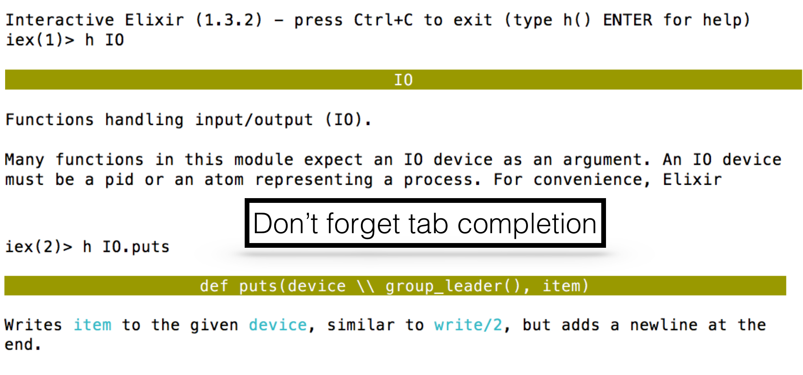
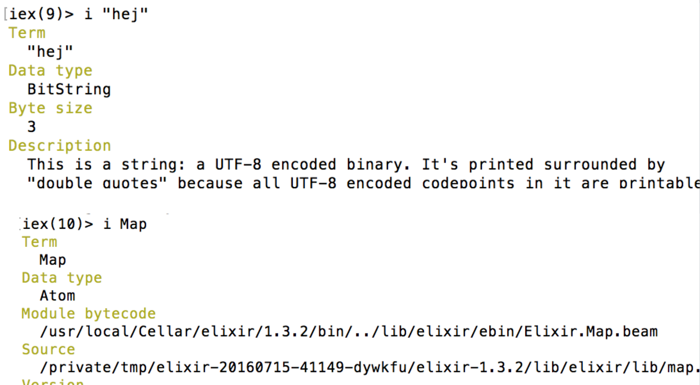

### Developer happiness with Elixir
# Elixir

Andreas Ronge (@ronge)


# Contents

* Language
* Tools
* Concurrency


## The language

* Interactive Elixir Shell
* Operators
* Datatypes
* Functions/Modules
* Pattern Matching
* Comprehension
* Control Flow
* Typespecs
* Behaviours
* Protocols
* Macros


## Tools

* Mix
* Plug
* ExUnit
* Deployment: distillery


## Concurrency

* Processes (TODO)
* Linking, trapping exit (TODO)


# IEX

[](img/iex.png)


## inspect

[]


## Hello World

```elixir
IO.puts "Hello"
```


## Compiling

```
iex> c "hello.exs"
iex> import_file "hello.exs"
```


## A Convention

* `.ex` files compiles to Erlang
* `.exs` intepreted


# Operators


## True and False

* Truth: `true`, `false`, `nil`


* strict: `===`

  `1 === 1.0 is false`

* value equality: `==`

  `1 == 1.0 is true`


## And/Or

* `or`, `and`

  `(1 and 0)` => (ArgumentError) argument error: 1

* `||`,  `&&`, `!`

  `(1 && 0)` => 0


## Operators: ++/--

```elixir
# ++ and -- are List functions
[1,2,3] ++ [4,5]
[1,2,3,4] -- [2,5] # => [1, 3, 4]
```


## String <> operator

To concatenate two Strings
```elixir
"hej" ++ "hopp"
```


## In operator

```elixir
2 in [1,2,3] # => true
x in some_enum
```


## The Pipe Operator

Instead of

```elixir
a = "abc"
b = do_x(a)
c = do_y(b, "foo")
d = do_z(c)
```

Use the pipe operator

```elixir
"abc" |> do_x |> do_y("foo") |> do_z
```


##  Phoenix

```elixir
connection
|> endpoint
|> router
|> pipeline
|> controller
```


# Data Types


## Atoms

Examples:
```elixir
:hej
:"hej"
:<>
FooBar
Hello.Foo
```


## Regular Expressions ~r{}

```elixir
~r[foo]
~r/foo/
~r<foo>
~r(foo)
String.match?("hej hopp", ~r/ho/)
```
~r is a sigil that creates a data type struct


## Tuples

Ordered collection of values

```elixir
{1,2}
{:ok, "Hej", false}
# nested
{:ok, {1, "foo", {true, false}}, [1,2,3]}
```


## List

```elixir
a = [1, 2, "hej", false]
List.first(a)  # not often used !

# Lists can be charlist !
IO.puts "hej #{[49, 50, 51]}"  # =>  hej 123
```


## string

Single-quoted and double quoted

* Holds UTF-8 characters
* Escapes sequences, `\n`, `\a`, ...
* Allows interpolation, `#{}` syntax

```elixir
name = "andreas"
IO.puts "Hello #{String.capitalize name}"
```


## Heredoc notation

Strings can span several lines.

```elixir
IO.write """
line 1
line 2
"""
```


## Charlist

```text
iex> i '123'
Term
  '123'
Data type
  List
Description
  This is a list of integers that is printed as a sequence of
  characters delimited by single quotes because all the integers
  in it represent valid ASCII characters. Conventionally, such
  lists of integers are referred to as "charlists" (more
  precisely, a charlist is a list of Unicode codepoints, and ASCII
  is a subset of Unicode).
Raw representation
  [49, 50, 51]
Reference modules
  List
```


## char list

A list of non-negative integers

```elixir
a = 'abc'
# example of list functions available
length a # => 3
Enum.reverse(a) # => 'cba'
'abcd' ++ 'de'
'abcd' -- 'de'
?a # => 97  The ascii code
 ```


## string

```text
iex> i "123"
Term
  "123"
Data type
  BitString
Byte size
  3
Description
  This is a string: a UTF-8 encoded binary.
  It's printed surrounded by "double quotes" because all UTF-8
  encoded codepoints in it are printable.
Raw representation
  <<49, 50, 51>>
Reference modules
  String, :binary
```

```text
byte_size "abc" # => 3
byte_size "ÄÄÄ" : # => 6
length 'ÄÄÄ' # => 3
```


## Sigils

Some more sigils:
```
# A double quoted string
~s[hej "]

# List of whitespace delimited words, no escaping or interpolation
~W<hej hopp x#{}>  

# Dates
~D[2001-01-01]
```


## Exercise

Write something so that
```
* "a,b,c" |> ... # => "c,b,a"
* concatenate two strings
```

(use the `Enum` and `String` modules)


## Answer

```elixir
"a,b,c" |> String.split(",") |> Enum.reverse |> Enum.join
```


## Binaries

```
iex> bit_size(<<0, 1, 2>>)
24

iex> << 1::size(2), 1::size(3) >>
<<9::size(5)>>

iex> bit_size(<<2.5::float>>)
64
```


## Keyword Lists

```text
iex> [{:a, 1}, {:b, 2}]      
[a: 1, b: 2]  # What ?

iex> [a: 1, b: 2]
[a: 1, b: 2]
```


## Keyword Lists

* Can be used with `Enum` and `Keyword`
* Keys are ordered
* Keys can be given more then once
* Square bracket optional in last arg


## Last argument

can be a keyword list

```elixir
defmodule Foo do                                   
  def foo(x,y), do: IO.puts("x: #{x} y: #{inspect y}")
end
```

```
iex(72)> Foo.foo "hej", a: 2                                 
x: hej y: [a: 2]
```


## Exercise

Check if key `:b` is in

```
[a: 1, b: 2, c: 3]
```

(use the Enum and Keyword Modules)


## Maps

* Allows any value as a key
* Keys do not follow any ordering
* Useful for pattern matching


## Maps

```
iex> x = %{:foo => 1, 2 => :bar, "hej" => "hopp"}
%{2 => :bar, :foo => 1, "hej" => "hopp"}

iex> x[:foo]
1

iex> x[2]
:bar

iex> x.foo
1

iex> x.qwe
** (KeyError) key :qwe not found in: %{2 => :bar, ...
```


## Map convenience

When all the keys in a map are atoms, you can use the keyword syntax

```
iex> map = %{a: 1, b: 2}
%{a: 1, b: 2}
```


## Exercise

Use the `Map` api to
* create a list of the keys of map
* change `bar` prop to "bye"
* add a new key and value

```
x = %{a: 1, foo: 42, bar: "hello"}
```


## More convenience

```
iex(15)> map = %{:a => 1, 2 => :b}
%{2 => :b, :a => 1}
iex(16)> map.a    # Strict access (prefer)
1

iex(17)> map.c    # Strict access
** (KeyError) key :c not found in: %{2 => :b, :a => 1}

iex(18)> map[:c]  # Dynamic access
nil

iex(17)> %{map | :a => 2}
%{2 => :b, :a => 2}

iex(18)> %{map | :c => 3}
** (KeyError) key :c not found in: %{2 => :b, :a => 1}
```


## Nested Data

```
iex> users = [
...>   john: %{name: "John", age: 27, languages: ["Erlang", "Ruby", "Elixir"]},
...>   mary: %{name: "Mary", age: 29, languages: ["Elixir", "F#", "Clojure"]}
...> ]
[john: %{age: 27, languages: ["Erlang", "Ruby", "Elixir"], name: "John"},
 mary: %{age: 29, languages: ["Elixir", "F#", "Clojure"], name: "Mary"}]

iex> users[:john].age
27
```


## Updates

put_in

```
iex)> users = put_in users[:john].age, 31

[john: %{age: 31, languages: ["Erlang", "Ruby", "Elixir"], name: "John"},
 mary: %{age: 29, languages: ["Elixir", "F#", "Clojure"], name: "Mary"}]
```


## Structs

* A map where all keys must be atom
* Only declared keys are allowed
* Compile time checks


## Example Usage

```elixir
defmodule Person do
  defstruct name: "", age: 0
end
```

```
iex> %Person{}
%Person{age: 0, name: ""}
iex> %Person{name: "Andreas"}
%Person{age: 0, name: "Andreas"}
iex> p = %Person{name: "Andreas"}
%Person{age: 0, name: "Andreas"}
iex> p.age
0
iex> p.qwe
** (KeyError) key :qwe not found in: %Person{age: 0, name: "Andreas"}
```


## Updating Structs

```
iex> me = Map.put(%{Person}, :name, "Andreas")
%Person{age: 0, name: "Andreas"}

iex(36)> %Person{me | name: "you"}
%Person{age: 0, name: "you"}

```


## Compile time checks

```elixir
defmodule User do
  defstruct name: "", age: 0
end

defmodule UserRepo do
  def create_user(name), do: %User{nam2e: name}
end
```

```
== Compilation error on file struct.ex ==
** (KeyError) key :nam2e not found in: %User{age: 0, name: ""}
    (stdlib) :maps.update(:nam2e, {:name, [line: 6], nil}, %User{age: 0, name: ""})
    struct.ex:2: anonymous fn/2 in User.__struct__/1
    (elixir) lib/enum.ex:1623: Enum."-reduce/3-lists^foldl/2-0-"/3
    expanding struct: User.__struct__/1
    struct.ex:6: UserRepo.create_user/1
```


## Exercise


```
%Plug.Conn{host: "www.example.com",
           path_info: ["bar", "baz"]}

```

* Create the struct
* Update host
* Add "foobar" to `path_info`


# Functions/Modules


## Anonymous functions

```
iex> sum = fn (a, b) -> a + b end
#Function<12.52032458/2 in :erl_eval.expr/5>

iex> sum.(1,2) # Notice the dot !
3
```


## Closures

```
x = 1
sum = fn y -> x + y end
sum.(2) #=> 3
```


## Modules

```elixir
defmodule MyModule do
  def sum(x, y) do
    x + y
  end

  # oneliner
  def add_one(x), do: sum(x, 1)  # No dot needed
end
```

```
iex> MyModule.add_one(42)
```


## import

* Not needed
* Allows using without fully-qualified name.

```
iex> import MyModule
iex> add_one(2)
```


## import scope

```elixir
defmodule Example do
  def func1 do
    List.flatten [1,[2,3],4]
  end

  def func2 do
    import List, only: [flatten: 1]
    flatten [5,[6,7],8]
  end
end
```


## Conventions

* `?` postfix returns false/true

  Example: `String.contains?/2`
* `!` postfix may throw exception

  Example: `File.open!/1`

* snake_case atoms, functions, variables and files.


## Nested Modules
and file location

```
lib
|-- ecto
|   |-- adapter
|   |   |-- migration.ex
```

```elixir
defmodule Ecto.Adapter.Migration  do
  # ...
end
```


## Function Refs

```
iex> a_func = &MyModule.add_one/1
&MyModule.add_one/1
iex> a_func.(2)

iex> l = &length/1
&:erlang.length/1
 ```


## Function shortcuts

```
iex(32)> sum = &(&1 + &2)
&:erlang.+/2   # <----- !!!!

iex(33)> sum.(1,2)
3
```


## Function returning function

```
iex> add_n = fn n -> (fn other -> n + other end) end
#Function<6.52032458/1 in :erl_eval.expr/5>

iex> add_two = add_n.(2)
#Function<6.52032458/1 in :erl_eval.expr/5>

iex> add_two.(3)
5

```


## Exercises

* Use `Enum.map` to make

   `[1,2,3] |> ___ => [2,3,4]`

* Write a function that takes a function so that

  `a_function.(fn -> "hej" end)`
  returns: "hej hopp"


## Solutions

* `[1,2,3] |> Enum.map(&(&1 + 1))`
* `a_function = fn(f) -> "#{f.()} hopp" end`


## Module attributes

```elixir
defmodule Example do
  @author "Andreas"
  def get_author do
    @author
  end
end

IO.puts "Example was written by #{Example.get_author}"
```


# Pattern Matching


## Simple values

```
iex> 1 = 1
1
iex> 1 = 0
** (MatchError) no match of right hand side value: 0

iex> 3 = x
3
iex> 4 = x
** (MatchError) no match of right hand side value: 3
iex> x = 4
4

iex> ^x = 4
4
iex> ^x = 5
** (MatchError) no match of right hand side value: 5
```


## Tuples

```
iex(1)> {a, b} = {1,2}
{1, 2}
iex(2)> {a, b} = {b, a}
{2, 1}
iex(3)> {x, _} = {{1,true}, "foo"}
{{1, true}, "foo"}
iex(4)> {{1, flag}, "foo"} =  {{1,true}, "foo"}
{{1, true}, "foo"}
iex(5)> flag
true
iex(6)> {q={1, flag}, "foo"} =  {{1,true}, "foo"}
{{1, true}, "foo"}
iex(7)> q
{1, true}
```


## Tuples Practical Examples

```
iex> {status, file} = File.open("mix.exs")
{:ok, #PID<0.83.0>}

iex> {:ok, file} = File.open("mix.exs")   
{:ok, #PID<0.85.0>}
```


## Arrays

```
list = [1, 2, 3]
[a, b, c ] = list   # Ok, a = 1, b = 2, c = 3
[a, 2, b ] = list   # OK
[a, 3, b ] = list   # Match Error
[a, b, c] = [1, [2, 3], 4]
[a, [b, _], c] = [1, [2, 3], 4]  # _ = I don’t care
```


## Exercises

Which will match when `x = 4` ?
1. `[a, b, a] = [1, 2, 3]`
2. `[a, b, a] = [1, 2, 1]`
3. `[_, b, a] = [1, 2, 3]`
4. `[a, b] = [1, 2, 3]`
5. `[a, b, c] = [1, 2]`
6. `[x, b, c] = [1, 2, 3]`
7. `[^x, b, c] = [1, 2, 3]`


## Append to array

```
[9 | [1,2,3]] # =>  [9,1,2,3]
```


## Strings
(binaries)

```elixir
"hej" <> hopp  = "hejhopp"
[h| t] = to_char_list("abcd")
```


## Head and Tails

```
iex> a = [1,2,3,4]
[1, 2, 3, 4]
iex> [h | t] = a
[1, 2, 3, 4]
iex> h
1
iex> t
[2, 3, 4]
```


## More heads

```
iex> [h1, h2 | t] = a
[1, 2, 3, 4]
iex> h1
1
iex> h2
2
iex> t
[3, 4]
```


## Pattern Matching Heads

```
iex> [t1, 2 | t] = a
[1, 2, 3, 4]

iex> [t1, 3 | t] = a
** (MatchError) no match of right hand side value: [1, 2, 3, 4]
```


## Heads with nested data

```
iex> icecreams = [{"cookies", 5}, {"chocolate", 3}, {"mint", 4}]
iex> [{name, _} | _] = icecreams
[{"cookies", 5}, {"chocolate", 3}, {"mint", 4}]
iex> name
"cookies"
```


## Advanced pattern matching

What does this do ?

```elixir
def for_location([ head = [_, target_loc, _, _ ] | tail], target_loc) do
 [ head | for_location(tail, target_loc) ]
end
```


## List and Recursion

```elixir
defmodule MyList do
  def len([]), do: 0
  def len([_head | tail]), do: 1 + len(tail)
end
```


## Keyword List

Rarely done since pattern matching on lists requires the number of items and their order to match

```
iex> [a: a] = [a: 1]
[a: 1]
```


## Maps

```
iex> %{:a => a} = %{:a => 1, 2 => :b}
%{2 => :b, :a => 1}

iex> a
1

iex> %{:c => c} = %{:a => 1, 2 => :b}
** (MatchError) no match of right hand side value: %{2 => :b, :a => 1}
```


## Exercises, Destructing

* Set `a = :bar` from `{:foo, :bar}`

  Solution: `{_, a} = {:foo, :bar}`
* Set `a=4` from the array `[[1,2], [3,4]]`
* Set `a = 4` and `b = [3, 4]` from `[[1,2], [3,4]]`
* Set `a="kalle"` from `[{3, %{name: "kalle"}}]`


## Functions args

```elixir
defmodule Fib do
  def fib(0) do 0 end
  def fib(1) do 1 end
  def fib(n) do fib(n-1) + fib(n-2) end
end
```


## Nested function args

```
iex> f = fn({_, price}) -> price end
iex> f.({"vanilla", 3})             
3

iex> icecreams = [{"cookies", 5}, {"chocolate", 3}, {"mint", 4}]
[{"cookies", 5}, {"chocolate", 3}, {"mint", 4}]
iex> first_name.(icecreams)
"cookies"
```


## Function with multiple bodies

```
iex> handle_open = fn
...> {:ok, file} -> "Read #{IO.read(file, :line)}"
...> {_, error} -> "Error: #{:file.format_error(error)}"
...> end
#Function<6.52032458/1 in :erl_eval.expr/5>

iex(6)> handle_open.(File.open("notexist.txt"))
"Error: no such file or directory"
```


## Exercises 1

Create a function: that returns the total price of all ice creams.
Use `Enum` functions

```
icecreams = [{"cookies", 5}, {"chocolate", 3}, {"mint", 4}]
```


## Solutions 1

```elixir
icecreams |> Enum.map(fn({_, price}) -> price end) |> Enum.sum
```


## Exercises 2, recursive

Create a Module/Function: that returns the total price of all ice creams.
Do not use `Enum` functions.

```
icecreams = [{"cookies", 5}, {"chocolate", 3}, {"mint", 4}]
```


## Guards

```elixir
defmodule Guard do
  def what_is(x) when is_number(x) do
    IO.puts "#{x} is a number"
  end

  def what_is(x) when is_list(x) do
    IO.puts "#{inspect(x)} is a list"
  end

  def what_is(x) when is_atom(x) do
    IO.puts "#{x} is an atom"
  end
end
Guard.what_is(99) # => 99 is a number
Guard.what_is(:cat) # => cat is an atom
Guard.what_is([1,2,3]) # => [1,2,3] is a list
```


# Comprehension


## Examples

```
iex> for n <- [1, 2, 3, 4], do: n * n
[1, 4, 9, 16]

iex> values = [good: 1, good: 2, bad: 3, good: 4]
[good: 1, good: 2, bad: 3, good: 4]

iex> for {:good, n} <- values, do: n * n
[1, 4, 16]

iex> multiple_of_3? = fn(n) -> rem(n, 3) == 0 end
#Function<6.52032458/1 in :erl_eval.expr/5>

iex> for n <- 0..5, multiple_of_3?.(n), do: n * n
[0, 9]
```


## into


```elixir
for {key, val} <- %{"a" => 1, "b" => 2}, into: %{}, do: {key, val * val}
%{"a" => 1, "b" => 4}
```


# Control Flow


## case, example 1

```elixir
case {1, 2, 3} do
 {1, x, 3} when x > 0 -> "Will match"
 _ ->  "Would match, if guard condition were not satisfied"
end
```

## case, example 2

```elixir
case :gen_tcp.connect 'localhost', 8001, [] do
  {:ok, pid } -> pid
  {:error, reason} -> handle_error(reason)
end
```


## cond

Find first  conditions that evaluates to true.

```
iex> cond do
...>   2 + 2 == 5 ->
...>     "This will not be true"
...>   2 * 2 == 3 ->
...>     "Nor this"
...>   1 + 1 == 2 ->
...>     "But this will"
...> end
"But this will"
```


## if and unless

```
iex> if nil do
...>   "This won't be seen"
...> else
...>   "This will"
...> end
"This will"
```


## if and unless, short

```
if true, do: 2, else: 4
```


# Stream module

Similar to Enum but supports lazy operations.


# Typespecs

* Used as documentation and for the Dialyzer tool
* Static analysis of code
* Extends the Erlang syntax


## Attributes

* `@type`
* `@opaque`
* `@typep`
* `@spec`
* `@callback`
* `@macrocallback`


## Basic Type

Examples, type ::
* any()
* none()
* pid()
* atom()
* integer()
* pos_integer


## Literals

Examples, type ::
* 1
* 1..10
* [type] # list of type
* [] empty list
* (type1, type2 -> type)  # function
* {:ok, type}  


## Module TYpes

Example:
* Range.t
* Enum.t
* String.t


## Defining type

* Syntax:

  `@type type_name :: type`

* Example of parameterized definition

  `@type dict(key, value) :: [{key, value}]`


## Specs

* Syntax:

  `@spec function_name(type1, type2) :: return_type`


## Example

```elixir
defmodule LousyCalculator do
  @typedoc """
  Just a number followed by a string.
  """
  @type number_with_remark :: {number, String.t}

  @spec add(number, number) :: number_with_remark
  def add(x, y), do: {x + y, "You need a calculator to do that?"}

  @spec multiply(number, number) :: number_with_remark
  def multiply(x, y), do: {x * y, "It is like addition on steroids."}
end
```


## Conventions

```elixir
defmodule User do
  defstruct [:name, :email]
  @type t :: %__MODULE__{name: String.t, email: String.t}
end

defmodule OtherModule do
  @spec find_user(String.t) :: User.t
  def find_user(user), do: User%{name: "kalle"}
end
```


# Behaviours

* A list of functions
* Compile time checked
* Similar to Java interfaces
* Defined with @callback
* Abstract generic functionalities


## Example, API

```elixir
defmodule Animal do
  @callback legs() :: integer
  @callback eats() :: String.t
end
```


## Implementation

```elixir
defmodule Cat do
  @behaviour Animal
  def legs, do: 4
  def eats, do: "cat food"
end
```


# Protocols
Polymorphism in Elixir
Extending external modules


## defprotocol

To define a new
```elixir
defprotocol Blank do
 @doc "Returns `true` if `data` is considered blank/empty"
 def blank?(data)
end
```


## defimpl

For each type we need to define implementations

```elixir
defimpl Blank, for: Integer do
 def blank?(number), do: false
end

# The only blank list is the empty one
defimpl Blank, for: List do
 def blank?([]), do: true
 def blank?(_),  do: false
end
```


## Extending Existing Protocols

The Collectable Protocol

```elixir
Enum.into([1,2,3], %{}, &({&1,&1*2}))
%{1 => 2, 2 => 4, 3 => 6}

# or
for {x,y} <- %{a: 1, b: 2, c: 3}, into: %{}, do: {x, y+1}
%{a: 2, b: 3, c: 4}
```


## Collectable.into

```
def into(collectable)                              

Returns a function that collects values alongside the initial
accumulation value.

The returned function receives a collectable and injects a
given value into it for every {:cont, term} instruction.

:done is passed when no further values will be injected, useful
for closing resources and normalizing values.
A collectable must be returned on :done.

If injection is suddenly interrupted, :halt is
passed and it can return any value, as it won't be used.
```


## API

```elixir
defprotocol Collectable do
  @type command :: {:cont, term} | :done | :halt

  @spec into(t) :: {term, (term, command -> t | term)}
  def into(collectable)
end
```


## Implementation, for Map

```elixir
defimpl Collectable, for: Map do
  # @type command :: {:cont, term} | :done | :halt
  # @spec into(t) :: {term, (term, command -> t | term)}
  def into(original) do
    {original, fn
      map, {:cont, {k, v}} -> :maps.put(k, v, map)
      map, :done -> map
      _, :halt -> :ok
    end}
  end
end
```


# Macros


## Example

```elixir
defmodule Hello do
  defmacro hello_macro do
    quote do
      def say_hello do
        IO.puts "Hello"
      end
    end
  end
end

defmodule MyModule do
  require Hello
  Hello.hello_macro
end

MyModule.say_hello
```


## using

`use` calls `__using__` macro

```elixir
defmodule HelloLibrary do  
  defmacro __using__(_) do
    quote do
      def say_hello, do: IO.puts("Hello")
    end
  end
end
```


## Using __using__

```elixir
defmodule MyModule do
  use HelloLibrary
end

MyModule.say_hello
```


### Using and Behaviour

```elixir
defmodule GenServer do
  defmacro __using__(_) do  
    quote do
      @behaviour :gen_server
```

GenServer module calls your callbacks.


# Tools

* Mix
* Plug
* ExUnit
* Deployment distillery


## Mix

Generate a new project

```
mix new my_plug
cd my_plug
```


## Add a dependency

Edit `mix.exs`

Add:

```
def application do
  [applications: [:cowboy, :plug]]
end

def deps do
  [{:cowboy, "~> 1.0.0"},
   {:plug, "~> 1.0"}]
end
```


## Download

```
mix deps.get
mix deps.compile
# or just: mix do deps.get, compile
```


## Plug

Add to lib/my_plug.ex:

```elixir
defmodule MyPlug do
  import Plug.Conn

  # Executed in compile time !
  def init(options) do
    options
  end

  #  @callback call(Plug.Conn.t, opts) :: Plug.Conn.t
  def call(conn, _opts) do
    conn
    |> put_resp_content_type("text/plain")
    |> send_resp(200, "Hello world")
  end
end
```


## test

Open iex with `iex -S mix`

```
{:ok, _} = Plug.Adapters.Cowboy.http MyPlug, []
```

Open browser http://localhost:4000


## more plug

```elixir
defmodule MyRouter do
  use Plug.Router

  plug :match
  plug :dispatch

  get "/hello" do
    send_resp(conn, 200, "world")
  end

  forward "/users", to: UsersRouter

  match _ do
    send_resp(conn, 404, "oops")
  end
end
```


## Pattern matching

```elixir
def call(%Plug.Conn{request_path: "/" <> name} = conn, opts) do
  send_resp(conn, 200, "Hello, #{name}")
end
```


## Deployment

[distillery](https://hexdocs.pm/distillery/getting-started.html)

```
defp deps do
   [..., {:distillery, "~> 0.9.9"}]
end
```

`mix deps.get`


## create a release

```
my_plug (master) mix release.init  # only first time

my_plug (master) $ mix release
==> Assembling release..
==> Building release my_plug:0.1.0 using environment dev
==> You have set dev_mode to true, skipping archival phase
==> Release successfully built!
    You can run it in one of the following ways:
      Interactive: rel/my_plug/bin/my_plug console
      Foreground: rel/my_plug/bin/my_plug foreground
      Daemon: rel/my_plug/bin/my_plug start
```


## start

`rel/my_plug/bin/my_plug start`


## upgrade

```
my_plug (master) $ mix release --upgrade
Compiling 2 files (.ex)
...
==> Release successfully built!
    You can run it in one of the following ways:
      Interactive: rel/my_plug/bin/my_plug console
      Foreground: rel/my_plug/bin/my_plug foreground
      Daemon: rel/my_plug/bin/my_plug start

my_plug (master) $ rel/my_plug/bin/my_plug upgrade 0.2.1
Release 0.2.1 not found, attempting to unpack releases/0.2.1/my_plug.tar.gz
Unpacked successfully: "0.2.1"
Installed Release: 0.2.1
Made release permanent: "0.2.1"
```


# Processes

* all code runs inside processes
* message passing, share nothing
* extremely lightweight
* takes advantage of a multi-core or multi-CPU computer
* each process has a private heap that is garbage collected independently
