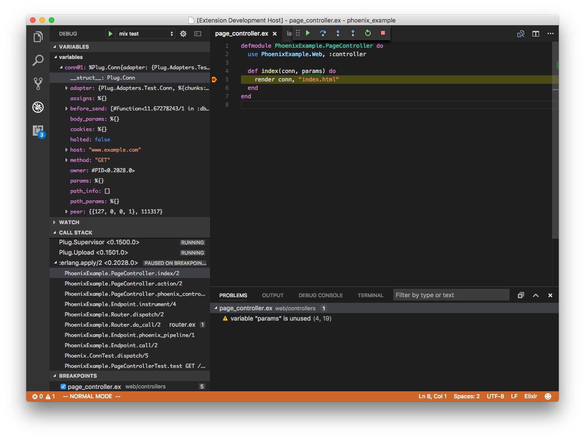
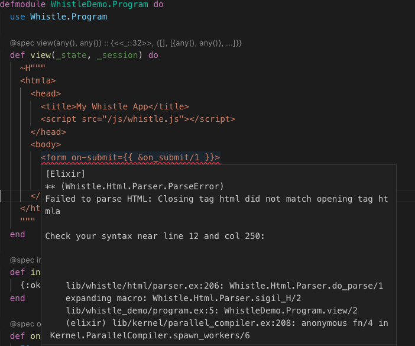
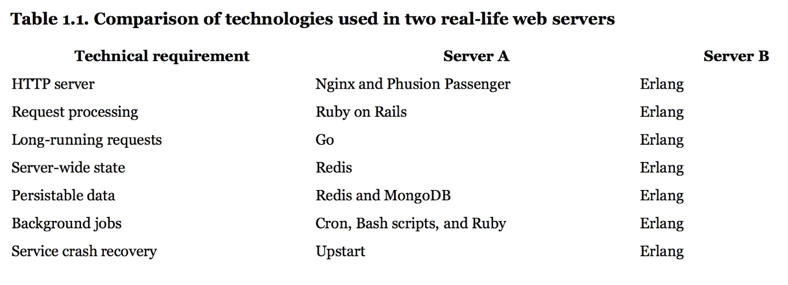

# Why Elixir ?

More than a language

[Back](/index.html)


## What is Erlang/OTP

* Created 1986 at Ericsson, Opensourced 1998
* Language 
  * Functional
  * Immutable data
  * Pattern matching
* Runtime system supporting distributed computing
* Components and design principles (OTP)
* Slogan: "Write once, run forever"


## History

In 1998 Ericsson announced the AXD301 switch, containing over a million lines of Erlang and reported to achieve a high availability of nine "9"s. 

Ericsson Radio Systems banned the in-house use of Erlang for new products, citing a preference for non-proprietary languages. The ban caused Armstrong and others to leave Ericsson. The implementation was open-sourced at the end of the year Ericsson eventually lifted the ban; it re-hired Armstrong in 2004. (wikipedia)


## Why Erlang

* Fault-tolerant
* High availability
* Hot code replacement
* Self healing network
* Distributed
* Soft real-time
* Hot swapping of code


## How, Beam

* support distributed computing
* everything is a process
* processes are strongly isolated
* message passing is the only way to interact


## How, OTP

* best practices based on years of experience
  * behaviours for servers, supervisors, event handling, statemachines, ...
* huge set of tooling/libraries, e.g
  * distributed database
  * static analysis tool called Dialyzer


## Who uses it

*	Game Servers, IoT (nerves), trading platforms, blockchain
*	CouchDB, Riak, RabbitMQ, ejabberd, web servers, connection pooling


## Who cares ?

* Support 2,277,845 simultaneous TCP connections on one machine
* How do you support 450 million users with only 32 engineers ?
* Downtime of 1 sec per 20 year
* Transparent message passing (remote and local)


## Who cares ?

But I don't have 2,277,845 TCP connections or need distributed computing


## Why you should care

* Performance, e.g.
  * better performance => simpler design
* Concurrency/Scalability/fault tolerance
  * Used everywhere: e.g. run concurrent isolated tests
  * actor model
* OTP design and ecosystem
  * how to distribute/config/assemble/reuse software

Simplicity


## What is Elixir ?

* A functional programming language run on the Erlang VM (BEAM)
* Created 2011 by Jose Valim
* Compiles to bytecode for BEAM


## Why Elixir, 1

* Since using Erlang VM, e.g:
  * Highly distributed system
  * Low latency & high availability
  * Great for parallel processing
* Since using Elixir:
  * Better productivity and extensibility
  * Modern functional language
  * Great tooling
  * Compatibility with Erlang's eco system


## Why Elixir, 2

* Stable language
* Extensible design (macros, protocols)
* Easy to learn - explicit, no magic
* First class documentation
* Syntax matters => maintainable code
* Excellent testing support
* Support on Google Cloud and soon on AWS Lambda
* Fun and productive language !


## Why Elixir, 3

* Built in tooling: e.g build/docs/monitoring/testing/code formatter ...
* Phoenix webframework
* Great people/community: Dave Thomas (pragdave), Bruce Tate, Jose Valim
* Rethink how we design software
* There is a demand for elixir developers, [examples](https://github.com/doomspork/elixir-companies/blob/master/src/_data/companies.yml)


## Example, Stateful Server

```elixir 
  # see https://moboudra.com/whistle-interactive-web-apps-with-elixir/
  def update({:increment, n}, state, session) do
    {:ok, state + n, session}
  end

  def update({:decrement, n}, state, session) do
    {:ok, state - n, session}
  end

  def view(state, _session) do
    Html.div([], [
      Html.button([on: [click: {:increment, 1}]], "+"),
      Html.text(to_string(state)),
      Html.button([on: [click: {:decrement, 1}]], "-")
    ])
  end
```


## Example, ExUnit

```
test "the truth" do
    assert 1 + 1 == 3
end

1) test the truth (HelloExunitTest)
   test/hello_exunit_test.exs:5
   Assertion with == failed
   code: 1 + 1 == 3
   lhs:  2
   rhs:  3
   stacktrace:
     test/hello_exunit_test.exs:6: (test)

Finished in 0.05 seconds
1 test, 1 failure
```


## Example, Docs

```
iex(4)> h Enum.map
                            def map(enumerable, fun)                            

  @spec map(t(), (element() -> any())) :: list()

Returns a list where each item is the result of invoking fun on each
corresponding item of enumerable.

For maps, the function expects a key-value tuple.

## Examples

    iex> Enum.map([1, 2, 3], fn x -> x * 2 end)
    [2, 4, 6]
    
    iex> Enum.map([a: 1, b: 2], fn {k, v} -> {k, -v} end)
    [a: -1, b: -2]
```


## Example, VsCode

[](img/vscode-elixir-ls.png)


## Type Info

[](img/vscode.png)


## Complile Time Macros

[](img/compile_errors_html.png)


## Less is More

Removing third party dependencies:

[](img/vscode.png)
([Elixir In Action](https://www.manning.com/books/elixir-in-action))


## Why not node ?

* JavasScript Fatigue
* Everyone think they can write JS code
  * mastering JS requires a significant amount of effort
* Immaturity of tooling/poor quality
* Single thread/event loop
  * if process crashes/blocked ...
* Imaging running a database inside your node application ...


## Some Resources

* [Elixir School](https://elixirschool.com/en/)
* [Elixir Lang, getting started](https://elixir-lang.org/getting-started/introduction.html)
* [Awesome Elixir](https://github.com/h4cc/awesome-elixir)
* [exercism.io](http://exercism.io/)
* [Would you still pick Elixir in 2019?](https://github.com/dwyl/learn-elixir/issues/102?utm_source=elixirdigest&utm_medium=email&utm_campaign=featured)
* IEX and elixir docs
* [Why I'm betting on elixir](https://rossta.net/blog/why-i-am-betting-on-elixir.html)

[Back](/index.html)

