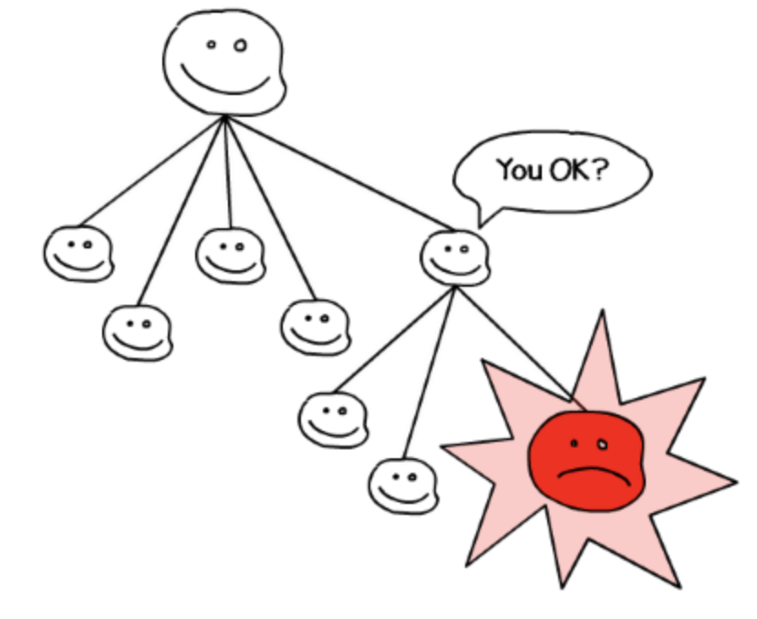
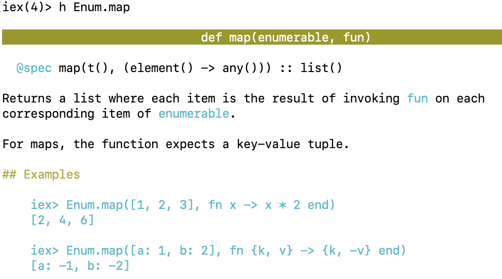
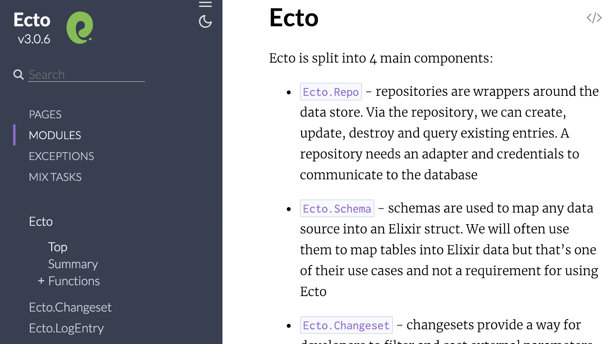

# Why Elixir ?

More than a language

[Back](index.html)


## What is Erlang/OTP

* Created 1986 at Ericsson, Opensourced 1998
* Language 
  * Functional
  * Immutable data
  * Pattern matching
* Runtime system supporting distributed computing
* Components and design principles (OTP)
* Slogan: "Write once, run forever"


## History

In 1998 Ericsson announced the AXD301 switch, containing over a million lines of Erlang and reported to achieve a high availability of nine "9"s. 

Ericsson Radio Systems banned the in-house use of Erlang for new products, citing a preference for non-proprietary languages. The ban caused Armstrong and others to leave Ericsson. The implementation was open-sourced at the end of the year Ericsson eventually lifted the ban; it re-hired Armstrong in 2004. (wikipedia)


## Why Erlang

* Fault-tolerant
* High availability
* Hot code replacement
* Self healing network
* Distributed
* Soft real-time
* Hot swapping of code


## How, Beam

* support distributed computing
* everything is a process
* processes are strongly isolated
* message passing is the only way to interact


## How, OTP

* best practices based on years of experience
  * behaviours for servers, supervisors, event handling, statemachines, ...
* huge set of tooling/libraries, e.g
  * distributed database
  * static analysis tool called Dialyzer


## Who uses Erlang ?

* instant-messaging systems, Game Servers, real-time trading/bidding platforms
* CouchDB, Riak, RabbitMQ, web servers


## Who cares ?

* Support 2,277,845 simultaneous TCP connections on one machine
* How do you support 450 million users with only 32 engineers ?
* Downtime of 1 sec per 20 year
* Transparent message passing (remote and local)


## Who cares ?

But I don't have 2,277,845 TCP connections or need distributed computing


## Why you should care

* Performance, e.g.
  * better performance => simpler design
* Concurrency/Scalability/fault tolerance
  * actor model everywhere
* OTP design and ecosystem
  * how to distribute/config/assemble/reuse software

Simplicity


## What is Elixir ?

* A functional programming language run on the Erlang VM (BEAM)
* Created 2011 by Jose Valim
* Compiles to bytecode for BEAM


## Why Elixir, 1

* Since using Erlang VM, e.g:
  * Highly distributed system
  * Low latency & high availability
  * Great for parallel processing
* Since using Elixir:
  * Better productivity and extensibility
  * Modern functional language
  * Great tooling
  * Compatibility with Erlang's eco system


## Why Elixir, 2

* Stable language
* Extensible design (macros, protocols)
* Easy to learn - explicit, no magic
* First class documentation
* Syntax matters => maintainable code
* Excellent testing support
* Support on Google Cloud and soon on AWS Lambda
* Fun and productive language !


## Why Elixir, 3

* Built in tooling: e.g build/docs/monitoring/testing/code formatter ...
* Phoenix webframework
* Great people/community: Dave Thomas (pragdave), Bruce Tate, Jose Valim
* Rethink how we design software
* There is a demand for elixir developers, [examples](https://github.com/doomspork/elixir-companies/blob/master/src/_data/companies.yml)


## Example, Supervisors

[](https://buildplease.com/pages/supervisors-csharp/)


## Example, Plug

```elixir
# https://github.com/elixir-plug/plug/blob/master/README.md
def hello_world_plug(conn, _opts) do
  conn
  |> put_resp_content_type("text/plain")
  |> send_resp(200, "Hello world")
end
```


## Example, Pattern Matching

```elixir
defmodule Fib do 
  def fib(0) do 0 end
  def fib(1) do 1 end
  def fib(n) do fib(n-1) + fib(n-2) end
end
```


## Example, Whistle

```elixir 
  def update({:increment, n}, state, session) do
    {:ok, state + n, session}
  end
  def update({:decrement, n}, state, session) do
    {:ok, state - n, session}
  end

  def view(state, _session) do
   ~H"""
    <div>
      <button on-click={{ :increment }}>+</button>
      <span>The current number is: {{ state }}></span>
      <button on-click={{ :decrement }}>-</button>
    </div>
    """
  end
```


## Example, ExUnit

```
test "the truth" do
    assert 1 + 1 == 3
end

1) test the truth (HelloExunitTest)
   test/hello_exunit_test.exs:5
   Assertion with == failed
   code: 1 + 1 == 3
   lhs:  2
   rhs:  3
   stacktrace:
     test/hello_exunit_test.exs:6: (test)

Finished in 0.05 seconds
1 test, 1 failure
```


## Example, Docs

[](img/iex-doc.png)


## Example, Docs

[](img/hexdoc.png)


## Example, VsCode

[](img/vscode-elixir-ls.png)


## Type Info

[](img/vscode.png)


## Complile Time Macros

[](img/compile_errors_html.png)


## Less is More

Removing third party dependencies:

[](img/vscode.png)
([Elixir In Action](https://www.manning.com/books/elixir-in-action))


## Why not Elixir

* Number crunching
* Small scripts
* Missing library ?


## Why not node ?

* JavasScript Fatigue
* Everyone think they can write JS code
  * mastering JS requires a significant amount of effort
* Immaturity of tooling/poor quality
* Single thread/event loop:
  * Don't block the event loop
  * Async concurrency models


## Random Links

* [Elixir School](https://elixirschool.com/en/)
* [Elixir Lang, getting started](https://elixir-lang.org/getting-started/introduction.html)
* [Hex Package Manager](https://hex.pm/)
* [exercism.io](http://exercism.io/)
* [Pod/Screen casts](https://github.com/elixir-lang/elixir/wiki/Podcasts-and-Screencasts), [The Rabbit Hole](https://www.stridenyc.com/podcasts)
* [Would you still pick Elixir in 2019?](https://github.com/dwyl/learn-elixir/issues/102?utm_source=elixirdigest&utm_medium=email&utm_campaign=featured)
* [Why I'm betting on elixir](https://rossta.net/blog/why-i-am-betting-on-elixir.html)
* [Malmo Elixir Meetup](https://www.meetup.com/Malmo-Elixir/)

[Back](index.html)

