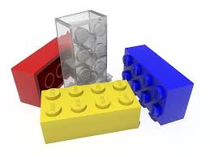

# Why Elixir ?

Andreas Ronge, @ronge

Consultant at Jayway

[Back](index.html)


## What is Erlang/OTP ?

* Functional Language
* Distributed Runtime System
* Tooling/Libraries/Design principles


## History

* 1985 - Built for Ericsson AXE telephone exhange
* 1998 - Open sourced (9 nines)
* &nbsp; &nbsp; | &nbsp; &nbsp; &nbsp;- Rabbit MQ, Whats Up, Klarna, ...
* 2014 - Elixir 1.0
* 2015 - Phoenix 1.0
* 2018 - Nerves 1.0

mature => ready to use


## Design for

* Massive Concurrency
* Distributed
* Soft real-time
* Extreme Reliability
* Hot swapping of code


## Useful for

* Telecom, GPRS/3G
* Message broker
* Distributed databases
* Webserver
* Finance and blockchains
* Webapps, realtime updates
* Embedded
* ...


## How, Beam

* Distributed OS for concurrency
  * isolated processes
  * message passing


#### Distributed Actor Model

[](img/processes.png)


## Elixir Example

State via Recursion

```elixir
defmodule MyState do
  def loop(state) do
    receive do
      {from, {:set, key, value}} ->
        loop(Map.put(state, key, value))
    end
  end
end
# pid = spawn(MyState, :loop, [%{bar: "foo"}])
```


## OTP

* A distributed runtime system (OS)
* Tooling and behaviours for parallel processing
* How to design/distribute/config/reuse...


## Why Erlang ?

[](https://buildplease.com/pages/supervisors-csharp/)


## The Holy Grail

of software development

[](https://buildplease.com/pages/supervisors-csharp/)

OTP Applications


## What is Elixir ?

* Functional programming language
* Run on Erlang VM (BEAM)
* Compiles to bytecode for BEAM


## Why Elixir ?

<div class="fragment" data-fragment-index="2">
Runs on Erlang/OTP
</div>
<div class="fragment" data-fragment-index="3">
Stable FP language
</div>
<div class="fragment" data-fragment-index="4">
Extensible design (macros, protocols)
</div>
<div class="fragment" data-fragment-index="5">
Easy to learn - explicit, no magic
</div>

<div class="fragment" data-fragment-index="6">
First class documentation
</div>
<div class="fragment" data-fragment-index="7">
Excellent builtin tooling
</div>
<div class="fragment" data-fragment-index="8">
Great testing support
</div>
<div class="fragment" data-fragment-index="9">
Phoenix webframework
</div>
<div class="fragment" data-fragment-index="10">
Great people/community
</div>
<div class="fragment" data-fragment-index="11">
Paradigm shift ?
</div>
<div class="fragment" data-fragment-index="12">
[Companies using elixir](https://github.com/doomspork/elixir-companies/blob/master/src/_data/companies.yml)
</div>


## Why not Elixir

* Number crunching
* Command line scripts
* Missing library ?


# Examples


## Github Issues

[](img/github-issues.png)

(Rust and Go has 4000+)


## Plug

[](img/plug.png)


## Example, Plug

```elixir
defmodule PlugA do
  def call(conn) do
    conn
    |> put_resp_content_type("text/plain")
    |> send_resp(200, "Hello world")
  end
end
# Usage:
# conn |> PlugA.conn |> PlugB.conn |> ...
```


## Pattern Matching Superpower

```elixir
defmodule Fib do 
  def fib(0) do 0 end
  def fib(1) do 1 end
  def fib(n) do fib(n-1) + fib(n-2) end
end
```


## Paradigm shift ?

```elixir 
  def update({:increment, n}, state, session) do
    {:ok, state + n, session}
  end
  def update({:decrement, n}, state, session) do
    {:ok, state - n, session}
  end

  def view(state, _session) do
   ~H"""
    <div>
      <button on-click={{ :increment }}>+</button>
      <span>The current number is: {{ state }}></span>
      <button on-click={{ :decrement }}>-</button>
    </div>
    """
  end
```


## Example, ExUnit

```
test "the truth" do
    assert 1 + 1 == 3
end

1) test the truth (HelloExunitTest)
   test/hello_exunit_test.exs:5
   Assertion with == failed
   code: 1 + 1 == 3
   lhs:  2
   rhs:  3
   stacktrace:
     test/hello_exunit_test.exs:6: (test)

Finished in 0.05 seconds
1 test, 1 failure
```


## Example, Docs

[](img/iex-doc.png)


## Example, Docs

[](img/hexdoc.png)


## Example, VsCode

[](img/vscode-elixir-ls.png)


## Type Info

[](img/vscode.png)


## Complile Time Macros

[](img/compile_errors_html.png)


## Less is More

Removing third party dependencies:

[](img/vscode.png)
([Elixir In Action](https://www.manning.com/books/elixir-in-action))


## Random Links

* [Elixir School](https://elixirschool.com/en/)
* [Elixir Lang, getting started](https://elixir-lang.org/getting-started/introduction.html)
* [Hex Package Manager](https://hex.pm/)
* [exercism.io](http://exercism.io/)
* [Pod/Screen casts](https://github.com/elixir-lang/elixir/wiki/Podcasts-and-Screencasts), [The Rabbit Hole](https://www.stridenyc.com/podcasts)
* [Would you still pick Elixir in 2019?](https://github.com/dwyl/learn-elixir/issues/102?utm_source=elixirdigest&utm_medium=email&utm_campaign=featured)
* [Why I'm betting on elixir](https://rossta.net/blog/why-i-am-betting-on-elixir.html)
* [Malmo Elixir Meetup](https://www.meetup.com/Malmo-Elixir/)

[Back](index.html)

